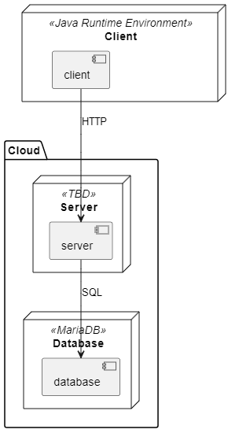

# 

**About arc42**

arc42, the template for documentation of software and system
architecture.

Template Version 8.2 EN. (based upon AsciiDoc version), January 2023

Created, maintained and © by Dr. Peter Hruschka, Dr. Gernot Starke and
contributors. See <https://arc42.org>.

# Introduction and Goals {#section-introduction-and-goals}

## Requirements Overview {#_requirements_overview}
We want to create an event planer, to allow users to create their own events and also to join others. Other features are an integrated calender, usergroups and chats. For detailed information visit our blog (https://letseventproject.wordpress.com/) or documentation(https://github.com/Impolex/event_planer/tree/main/documentation).

## Stakeholders {#_stakeholders}

| Role/Name   | Contact                   | Expectations              |
|-------------|---------------------------|-----------------------|
| Product_owner | Dawid          | Usability        |
| Developer| Lukas            | Security        |
| Scrum_master | Julian            | Reliability        |

# Constraints {#section-constraints}

## Technical-Constraints {#section-technical-constraints}
We work with Java and use MariaDB as our database.

# Architecture Constraints {#section-architecture-constraints}

* Classes are not to be forced to implement methods, which will not be used by this class

# System Scope and Context {#section-system-scope-and-context}

| Element                   | Description                                                                                                                       |
| ------------------------- | --------------------------------------------------------------------------------------------------------------------------------- |
| Letsevent app             | The client-side application                                                                                                       |
| database connector/server | The server which the users connect to when using the application. Manages requests from the users and responses from the database |
| database                  | The database which holds any data the users create                                                                                |

## Business Context {#_business_context}

There are no communication partners, other than the communication between the application and server, and between the server and database, which are all part of the system.

## Technical Context {#_technical_context}

|Element|Description|
|--------|----------|
|Letsevent app|The client-side application|
|database connector/server|The server which the users connect to when using the application. Manages requests from the users and responses from the database|
|database|The database which holds any data the users create|

# Solution Strategy {#section-solution-strategy}

A short summary of our technical decisions:
- Programming language Java
- Maria DB Data Bank server
- Github for documentation and code
- Wordpressblog for sharing our progress

We are using the Model-View-Controller pattern.

To guarantee the usability of our programm, we are planning on choosing random testers who are not in any way related to our project. This will show us how user friendly our Gui is and where and how we can improve it.

The security of the user data will be ensured by a strong and safe encryption algorythm.
# Building Block View {#section-building-block-view}

# Runtime View {#section-runtime-view}

## \<Runtime Signing up> {#__runtime_scenario_1}

- To create a user, the client sends a request to the server, which then creates the user by storing it to the database.

## \<Runtime Loging in> {#__runtime_scenario_2}

- To login the client sends a request to the server. To server compares the credentials with the database. If successfull the servers provides an access token.

## \<Runtime Creating an event> {#__runtime_scenario_n}

- To create an event, the client sends a request to the server, which then creates the event by storing it to the database.

# Deployment View {#section-deployment-view}

## Infrastructure general {#_infrastructure_level_1}

The below diagramm describes the applications components deployment.

## Software Requirements

- The client is written in Java and thus needs the Java Runtime-Environment to be executed.
- For the Server the technology used has to be decided

## Protocols

- The communication between client and server works with HTTP.

- The communication between the server and the database uses SQL with MariaDBs protocol

# Cross-cutting Concepts {#section-concepts}

## *\1: Connecting to the Database

The user will have to connect to our database to create, edit and view events and communicate with other users. This will be accomplished using a connector application, which takes user requests, processes and forwards those to the database. After that, the response from the database will be received, processed and returned to the user. 

The requests, which the users can send, are as follows: 
- Fetching events/user data/groups
- Saving and updating events/user data/groups

## *\2: UI Interfaces

Every UI class extends a fitting interface. Those interfaces provide a minimal, but sufficient, amount of methods.

This way every UI class has the same set of basic methods, like opening and closing the window or refreshing the content. Therefore those classes can be used in similar ways, regardless what specific UI it is. Also no class is forced to implement methods which it has no use for. For example, a event overview has no need for a method which sends a message to a chat.

## *\3: Error handling

Should the user encounter an error while using LetsEvent, they will be notified by a popup window. If the error is connected to the program itself, the error message will be verbose to help the user understand what went wrong. If the error is connected to the API, the error message will be vague, to prevent malicious actors from causing damage. Should the error be something uncaught, the stack trace will be shown to the user with steps to report this error to the development team.

## *\4: Testing

The functionality of methods and UIs is tested with unit tests, powered by JUnit 5.11.0. The developers are free to run the unit tests locally whenever they wish. Before merging into the main branch those tests are run automatically through Maven and GitHub actions. Should any of those tests fail, the merge will be aborted and the developer will be notified. Those tests are only run if there have been any changes to the source code. 

# Architecture Decisions {#section-design-decisions}

LetsEvent follows a "Model-View-Controller" scheme, whereas the classes of the user interface define the "View", the database API defines the "Model" and the functional classes define the "Controller". 
The reason behind this is a clear separation between the elements, which allows working on an specific element, without impacting the other elements.

	Example: Usage of a different graphic framework

+ The user interface is not aware of the database's existence. It simply receives the data to be displayed from the controller.
+ The database API is not aware of the user interface's existence. It simply delivers the data which was requested by the controller or responds with an errors, should those occur.
# Quality Requirements {#section-quality-scenarios}

## Quality Tree {#_quality_tree}

## Quality Scenarios {#_quality_scenarios}

- Within 10 minutes, the user can complete the event creation process, after which, the event is saved in the database
- When the user creates an account, a hash algorithm is applied to the credentials before saving in the database
- After completing the software update, the development team can apply the update within 2 hours
- Should the database become unavailable, a message will be displayed to the user and the admins will be notified. Unavailability must not be more than 5h per week
- When the user requests the data of an event, the time between the request reaching the server and the answer leaving the server should be less than 5s

# Risks and Technical Debts {#section-technical-risks}

## *\1: Unavailability of the databank

This is something that will inevitably happen. Either through a error, or maintenance. Since the databank is a crucial component of LetsEvent, measures must be taken to minimize the damage this brings.

### Scheduled unavailability

In case of maintenance, the begin and estimated time must be communicated to the users ahead of time.

### Irregular unavailability

Should the databank become unavailable unexpectedly, the users must be notified through the UI as soon as possible. Further communication must happen preferably though the UI as well.
Alternatives would be communication though social media. This would be simple enough to do in any case, however, it would be not sufficient, as we can't expect everyone to follow social media.
Notifying every registered email address would be possible by setting up a email distributor list.

### Further measures

Our first priority should be identifying the issue, if not already known (eg. maintenance). To minimize the impact on our users work, we should allow the users to work offline and commit their changes when the databank is back online.
Before that, we need to figure out how we would deal with contradicting data. For example, what if multiple users modified the description of the same event? We could either cancel the change or apply the last change. For that, we would need to save the timestamp of the edit and send to to the databank server.

## *\2: Not paying enough attention to the project progress

We have to make sure that our projects development does not come to a hold, in order to hit our release deadline. This is an effort every team member is responsible for. If anyone notices any issues with the progress they should notify the other members.

## *\3: Unauthorized access to data

 We have to make sure, to the best of our abilities, that no unauthorized party gains access to our users data. In case this happens despite our efforts, we need to implement measures to minimize the damage, as failure to do so would be a massive issue to our program, as well as to the trust our users have put in LetsEvent.
 To achieve that, we will put some common security practices in place.

### Whitelisting instead of blacklisting

Access to the databank is regulated though our API and server. Instead of restricting specific actions of users, we have to allow only the required actions.

### Prepared statements

To prevent injection attacks, we will not allow users to send direct SQL statements to our databank. Any action will be in form of an prepared statement, which hinders malicious actors from executing their own statements.

### Encrypting sensitive data

Sensitive data will never be transferred as plain text. Before sending over to our server, and before saving, data like email addresses and passwords will be encrypted using undisclosed algorithms. Double encryption will make sure that data is not transferred as plain text, and will prevent malicious actors from breaking the algorithm from our code, as they have no access to our server.

## *\4: (Temporary) Lowering of workforce

Should members of the team be unable/unwilling to continue work, tasks will need to be redistributed.

## *\5: Failure to meet deadline

When the project completion is in danger, the team will have to individually decide how to prevent that. Possible solutions would be redistributing tasks where possible, or scratching features.
# Glossary {#section-glossary}

| Term      | Definition                                                 |
| --------- | ---------------------------------------------------------- |
| Event     | A meeting of any kind                                      |
| Host      | The mostly responsible person for an event                 |
| Organizer | A person which was given administrative access to an event |
