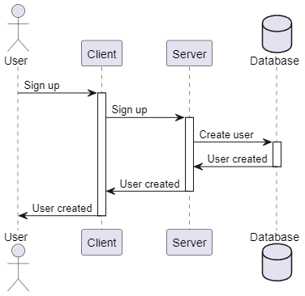
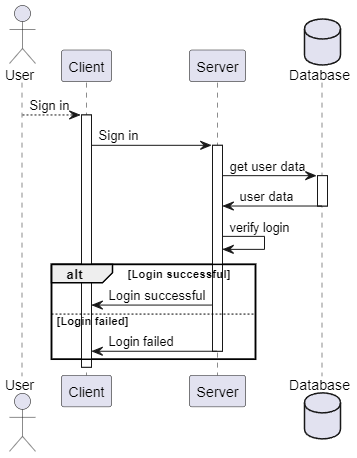
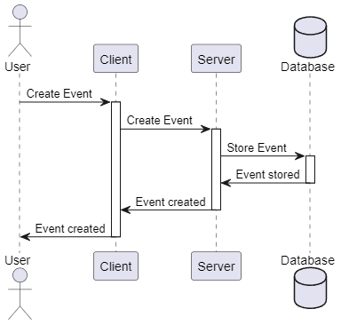

# 

**About arc42**

arc42, the template for documentation of software and system
architecture.

Template Version 8.2 EN. (based upon AsciiDoc version), January 2023

Created, maintained and © by Dr. Peter Hruschka, Dr. Gernot Starke and
contributors. See <https://arc42.org>.

::: note
This version of the template contains some help and explanations. It is
used for familiarization with arc42 and the understanding of the
concepts. For documentation of your own system you use better the
*plain* version.
:::

# 

# Introduction and Goals {#section-introduction-and-goals}

## Requirements Overview {#_requirements_overview}
We want to create an event planer, to allow users to create their own events and also to join others. Other features are an integrated calender, usergroups and chats. For detailed information visit our blog (https://letseventproject.wordpress.com/) or documentation(https://github.com/Impolex/event_planer/tree/main/documentation).

## Stakeholders {#_stakeholders}

| Role/Name   | Contact                   | Expectations              |
|-------------|---------------------------|-----------------------|
| Product_owner | Dawid          | Usability        |
| Developer| Lukas            | Security        |
| Scrum_master | Julian            | Reliability        |

# Constraints {#section-constraints}

## Technical-Constraints {#section-technical-constraints}
We work with Java and use MariaDB as our database.

# Architecture Constraints {#section-architecture-constraints}

* Classes are not to be forced to implement methods, which will not be used by this class

# System Scope and Context {#section-system-scope-and-context}

|Element|Description|
|--------|----------|
|Letsevent app|The client-side application|
|database connector/server|The server which the users connect to when using the application. Manages requests from the users and responses from the database|
|database|The database which holds any data the users create|

## Business Context {#_business_context}

There are no communication partners, other than the communication between the application and server, and between the server and database, which are all part of the system.

## Technical Context {#_technical_context}

|Element|Description|
|--------|----------|
|Letsevent app|The client-side application|
|database connector/server|The server which the users connect to when using the application. Manages requests from the users and responses from the database|
|database|The database which holds any data the users create|

# Solution Strategy {#section-solution-strategy}

A short summary of our technical decisions:
- Programming language Java
- Maria DB Data Bank server
- Github for documentation and code
- Wordpressblog for sharing our progress

We are using the Model-View-Controller pattern.

To guarantee the usability of our programm, we are planning on choosing random testers who are not in any way related to our project. This will show us how user friendly our Gui is and where and how we can improve it.

The security of the user data will be ensured by a strong and safe encryption algorythm.
# Building Block View {#section-building-block-view}

## \<Runtime Signing up> {#__runtime_scenario_1}

- To create a user, the client sends a request to the server, which then creates the user by storing it to the database.

## \<Runtime Loging in> {#__runtime_scenario_2}

- To login the client sends a request to the server. To server compares the credentials with the database. If successfull the servers provides an access token.

## \<Runtime Creating an event> {#__runtime_scenario_n}

- To create an event, the client sends a request to the server, which then creates the event by storing it to the database.

# Deployment View {#section-deployment-view}

::: formalpara-title
**Content**
:::

The deployment view describes:

1.  technical infrastructure used to execute your system, with
    infrastructure elements like geographical locations, environments,
    computers, processors, channels and net topologies as well as other
    infrastructure elements and

2.  mapping of (software) building blocks to that infrastructure
    elements.

Often systems are executed in different environments, e.g. development
environment, test environment, production environment. In such cases you
should document all relevant environments.

Especially document a deployment view if your software is executed as
distributed system with more than one computer, processor, server or
container or when you design and construct your own hardware processors
and chips.

From a software perspective it is sufficient to capture only those
elements of an infrastructure that are needed to show a deployment of
your building blocks. Hardware architects can go beyond that and
describe an infrastructure to any level of detail they need to capture.

::: formalpara-title
**Motivation**
:::

Software does not run without hardware. This underlying infrastructure
can and will influence a system and/or some cross-cutting concepts.
Therefore, there is a need to know the infrastructure.

Maybe a highest level deployment diagram is already contained in section
3.2. as technical context with your own infrastructure as ONE black box.
In this section one can zoom into this black box using additional
deployment diagrams:

-   UML offers deployment diagrams to express that view. Use it,
    probably with nested diagrams, when your infrastructure is more
    complex.

-   When your (hardware) stakeholders prefer other kinds of diagrams
    rather than a deployment diagram, let them use any kind that is able
    to show nodes and channels of the infrastructure.

See [Deployment View](https://docs.arc42.org/section-7/) in the arc42
documentation.

## Infrastructure Level 1 {#_infrastructure_level_1}

Describe (usually in a combination of diagrams, tables, and text):

-   distribution of a system to multiple locations, environments,
    computers, processors, .., as well as physical connections between
    them

-   important justifications or motivations for this deployment
    structure

-   quality and/or performance features of this infrastructure

-   mapping of software artifacts to elements of this infrastructure

For multiple environments or alternative deployments please copy and
adapt this section of arc42 for all relevant environments.

***\<Overview Diagram>***

Motivation

:   *\<explanation in text form>*

Quality and/or Performance Features

:   *\<explanation in text form>*

Mapping of Building Blocks to Infrastructure

:   *\<description of the mapping>*

## Infrastructure Level 2 {#_infrastructure_level_2}

Here you can include the internal structure of (some) infrastructure
elements from level 1.

Please copy the structure from level 1 for each selected element.

### *\<Infrastructure Element 1>* {#__emphasis_infrastructure_element_1_emphasis}

*\<diagram + explanation>*

### *\<Infrastructure Element 2>* {#__emphasis_infrastructure_element_2_emphasis}

*\<diagram + explanation>*

...

### *\<Infrastructure Element n>* {#__emphasis_infrastructure_element_n_emphasis}

*\<diagram + explanation>*

# Cross-cutting Concepts {#section-concepts}

::: formalpara-title
**Content**
:::

This section describes overall, principal regulations and solution ideas
that are relevant in multiple parts (= cross-cutting) of your system.
Such concepts are often related to multiple building blocks. They can
include many different topics, such as

-   models, especially domain models

-   architecture or design patterns

-   rules for using specific technology

-   principal, often technical decisions of an overarching (=
    cross-cutting) nature

-   implementation rules

::: formalpara-title
**Motivation**
:::

Concepts form the basis for *conceptual integrity* (consistency,
homogeneity) of the architecture. Thus, they are an important
contribution to achieve inner qualities of your system.

Some of these concepts cannot be assigned to individual building blocks,
e.g. security or safety.

::: formalpara-title
**Form**
:::

The form can be varied:

-   concept papers with any kind of structure

-   cross-cutting model excerpts or scenarios using notations of the
    architecture views

-   sample implementations, especially for technical concepts

-   reference to typical usage of standard frameworks (e.g. using
    Hibernate for object/relational mapping)

::: formalpara-title
**Structure**
:::

A potential (but not mandatory) structure for this section could be:

-   Domain concepts

-   User Experience concepts (UX)

-   Safety and security concepts

-   Architecture and design patterns

-   \"Under-the-hood\"

-   development concepts

-   operational concepts

Note: it might be difficult to assign individual concepts to one
specific topic on this list.

See [Concepts](https://docs.arc42.org/section-8/) in the arc42
documentation.

## *\1: Connecting to the Database

The user will have to connect to our database to create, edit and view events and communicate with other users. This will be acomplished using a connector application, which takes user requests, processes and forwards those to the database. After that, the response from the database will be recieved, processed and returned to the user. 

The requests, which the users can send, are as follows: 
- Fetching events/user data/groups
- Saving and updating events/user data/groups

# Architecture Decisions {#section-design-decisions}

Letsevent follows a "Model-View-Controller" scheme, whereas the classes of the user interface define the "View", the database defines the "Model" and the functional classes define the "Controller". 
The reason behind this is a clear seperation between the elements, which allows working on an specific element, without impacting the other elements.

	Example: Usage of a different graphic framework

+ The user interface is not aware of the database's existance. It simply recieves the data to be displayed from the controller.
+ The database is not aware of the user interface's existance. It simply delivers the data which was requested by the controller or responds with an errors, should those occur.
# Quality Requirements {#section-quality-scenarios}

## Quality Tree {#_quality_tree}

## Quality Scenarios {#_quality_scenarios}

- Within 10 minutes, the user can complete the event creation process, after which, the event is saved in the database
- When the user creates an account, a hash algorithm is applied to the credentials before saving in the database
- After completing the software update, the development team can apply the update within 2 hours
- Should the database become unavailable, a message will be displayed to the user and the admins will be notified. Unavailability must not be more than 5h per week
- When the user requests the data of an event, the time between the request reaching the server and the answer leaving the server should be less than 5s

---------------------------------------------------------------------
	Relevant during 4th semester
# Risks and Technical Debts {#section-technical-risks}

::: formalpara-title
**Contents**
:::

A list of identified technical risks or technical debts, ordered by
priority

::: formalpara-title
**Motivation**
:::

"Risk management is project management for grown-ups" (Tim Lister,
Atlantic Systems Guild.)

This should be your motto for systematic detection and evaluation of
risks and technical debts in the architecture, which will be needed by
management stakeholders (e.g. project managers, product owners) as part
of the overall risk analysis and measurement planning.

::: formalpara-title
**Form**
:::

List of risks and/or technical debts, probably including suggested
measures to minimize, mitigate or avoid risks or reduce technical debts.

See [Risks and Technical Debt](https://docs.arc42.org/section-11/) in
the arc42 documentation.

# Glossary {#section-glossary}

::: formalpara-title
**Contents**
:::

The most important domain and technical terms that your stakeholders use
when discussing the system.

You can also see the glossary as source for translations if you work in
multi-language teams.

::: formalpara-title
**Motivation**
:::

You should clearly define your terms, so that all stakeholders

-   have an identical understanding of these terms

-   do not use synonyms and homonyms

A table with columns \<Term> and \<Definition>.

Potentially more columns in case you need translations.

See [Glossary](https://docs.arc42.org/section-12/) in the arc42
documentation.

+-----------------------+-----------------------------------------------+
| Term                  | Definition                                    |
+=======================+===============================================+
| *\<Term-1>*           | *\<definition-1>*                             |
+-----------------------+-----------------------------------------------+
| *\<Term-2>*           | *\<definition-2>*                             |
+-----------------------+-----------------------------------------------+
